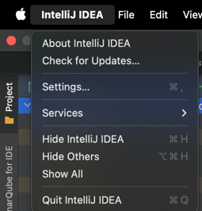
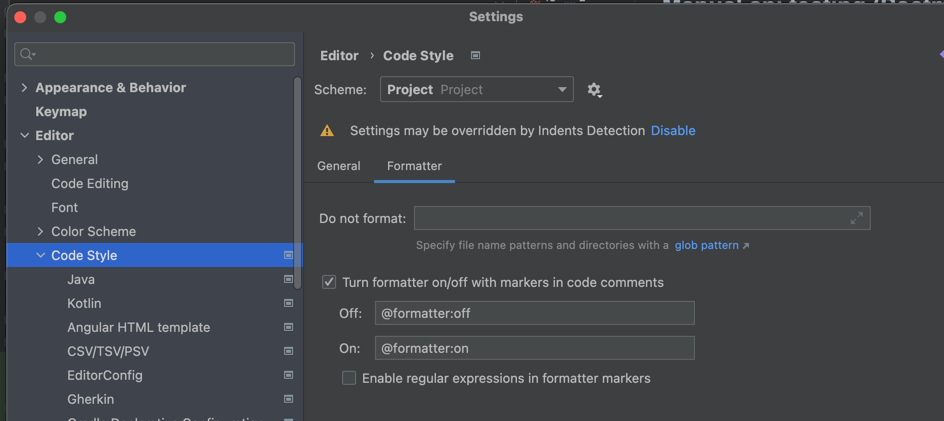
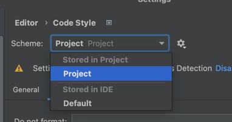

# Opal Fines Service
[](https://hmcts.github.io/cnp-api-docs/swagger.html?url=https://hmcts.github.io/cnp-api-docs/specs/opal-fines-service.json)
[](https://sonarcloud.io/summary/new_code?id=uk.gov.hmcts%3Aopal-fines-service)
[](https://sonarcloud.io/summary/new_code?id=uk.gov.hmcts%3Aopal-fines-service)

## Getting Started

### Prerequisites
- [JDK 21](https://java.com)
- [Docker](https://docker.com)

## Building and deploying the application

### Running the application

#### Environment variables

The following environment variables are required to run the service.

```bash / zsh
AAD_CLIENT_ID= <Ask Team Memebers>
AAD_CLIENT_SECRET=<Ask Team Memebers>
AAD_TENANT_ID=<Ask Team Memebers>
OPAL_TEST_USER_PASSWORD=<Ask Team Memebers>

LAUNCH_DARKLY_SDK_KEY=<Ask Team Memebers>
```

You can also create a shared .env.shred file with these variables you can use the `create_env.sh` script from opal-shared-infrastructure:
But these will only get picked up when running the application with docker.
So for local development, you will need to set these environment variables in your IDE run configuration or terminal session.
```bash / zsh
../opal-shared-infrastructure/bin/create_env.sh
```
#### Caching

Redis has been configured as the default caching provider. When running docker-compose with the local configuration a Redis container will be started.

If starting the opal-fines-service from Intellij or the command line you have the following options:
Follow instructions under 'Running the application locally'

In local env by default opal-fines-service uses simple cache instead of Redis cache. This can be enabled by setting this env variable:
```bash / zsh
OPAL_REDIS_ENABLED=true
```

Alternatively the opal-fines-service can be run using a simple in-memory cache by starting the application with the profile in-memory-caching.

To view the cache - when running against local Redis - Intellij has a free plugin called Redis Helper.
However, if you want to view the cache in staging the plugin doesn't support SSL. Instead, install:

```bash
brew install --cask another-redis-desktop-manager
sudo xattr -rd com.apple.quarantine /Applications/Another\ Redis\ Desktop\ Manager.app
```

You can also run redis container in local docker: (Not required if using Approach 4 as this spins up all your dependencies)
**Bash**:
```bash
  docker-compose up redis
```
**Zsh**:
```zsh
  docker compose up redis
```

**WARNING** - As of 10/02/2026 the recommended docker approach is "Approach 4: Docker with external dependencies"
#### Approach 1: Dev Application (No existing dependencies)

The simplest way to run the application is using the `bootTestRun` Gradle task:

```bash / zsh
  ./gradlew bootTestRun
```

This task has no dependencies and starts up a Postgres database in Docker using [Testcontainers](https://testcontainers.com).
The database is available on `jdbc:postgresql://localhost:5432/opal-fines-db` with username and password `opal-fines`.

To persist the database between application restarts set the environment variable `TESTCONTAINERS_REUSE_ENABLE` to `true`.
Note this does **not** persist data if the Docker container is manually stopped, or through laptop restarts).

#### Approach 2: Dev Application (With existing dependencies)

Use the standard Spring Boot `run` Gradle task:

```bash / zsh
  ./gradlew run
```

This approach can be used if a database is already running and may be preferred if the lack of long-term data persistence
from the previous approach is an issue for development.

#### Approach 3: Docker

Create the image of the application by executing the following command:

```bash / zsh
  ./gradlew assemble
```

Create docker image:

**Bash**:
```bash
  docker-compose build
```
**Zsh**:
```zsh
  docker compose build
```

Run the distribution (created in `build/install/opal-fines-service` directory)
by executing the following command:

**Bash**:
```bash
  docker-compose up
```
**Zsh**:
```zsh
  docker compose up
```

To skip all the setting up and building with Docker, just execute the following command:

```bash / zsh
./bin/run-in-docker.sh
```

For more information:

```bash / zsh
./bin/run-in-docker.sh -h
```
Script includes bare minimum environment variables necessary to start api instance. Whenever any variable is changed or any other script regarding docker image/container build, the suggested way to ensure all is cleaned up properly is by this command:

**Bash**:
```bash
docker-compose rm
```
**Zsh**:
```zsh
docker compose rm
```

It clears stopped containers correctly. Might consider removing clutter of images too, especially the ones fiddled with:

```bash / zsh
docker images

docker image rm <image-id>
```

There is no need to remove postgres and java or similar core images.


#### Approach 4: Docker with external dependencies (e.g. Redis, postgres, azure service bus, user service, logging service, etc) - Recommended approach for development

Ensure you have pulled opal-shared-infrasturcutre as this contains scripts to support docker.

First you will need to ensure you have all repositories downloaded in the same parent direcotry.
To do this automatically you can run the following command from the opal-shared-infrastructure directory:
```bash / zsh
../opal-shared-infrastructure/bin/pull_all_repos.sh
```

Secondly you will need to ensure you have the required environment variables set up in a .env.shared file in the opal-shared-infrastructure/docker-files/ directory. You can use the following command to create this file with the required variables:
```bash / zsh
../opal-shared-infrastructure/bin/create_env.sh
```

Finally to run the application with all external dependencies using docker you can run the following command from the opal-shared-infrastructure directory:
```bash / zsh
../opal-shared-infrastructure/docker-files/scripts/opalBuild.sh -lb
```
Full details of this script and the arguments can be found within the opal-shared-infrastructure repository

* [Link to file on Github](https://github.com/hmcts/opal-shared-infrastructure/blob/master/docker-files/scripts/scripts-readme.md)
* [Link to file locally](../opal-shared-infrastructure/docker-files/scripts/scripts-readme.md)

### Verifying application startup

Regardless of approach followed for starting the application, in order to test if the application is up, you can call its health endpoint:

```bash / zsh
  curl http://localhost:4550/health
```

You should get a response similar to this:

```
  {"status":"UP","diskSpace":{"status":"UP","total":249644974080,"free":137188298752,"threshold":10485760}}
```

### Building the application

The project uses [Gradle](https://gradle.org) as a build tool. It already contains
`./gradlew` wrapper script, so there's no need to install gradle.

To build the project execute the following command:

```bash / zsh
  ./gradlew build
```

### Functional test tasks

Use the standard functional suite for normal backend functional coverage:

```bash / zsh
  ./gradlew functional
```

This runs the default Opal and Legacy functional suites and publishes the Serenity
functional report under `functional-test-report/`.

Use the tagged Opal functional suite when you need to run only scenarios for a specific
feature-flag or business-area configuration:

```bash / zsh
  TAGS='@R1BOff and not @Ignore' ./gradlew functionalOpalTags
```

You can also pass the tags as a Gradle property instead of an environment variable:

```bash / zsh
  ./gradlew functionalOpalTags -Ptags='@R1B and @R1C and not @Ignore'
```

Use the combined tagged wrapper when you want the default Opal suite and the tagged Opal
scenarios in one run, with the same Serenity report and merged JUnit summary flow used by
the standard `functional` task:

```bash / zsh
  TAGS='@R1BOff and not @Ignore' ./gradlew functionalWithTags
```

Use the Zephyr variant when you want the same combined tagged run and the tagged Opal
execution recorded through the existing cucumber-report Zephyr flow:

```bash / zsh
  TAGS='@R1BOff and not @Ignore' ./gradlew functionalWithTagsWithZephyrExecution
```

Common examples:

```bash / zsh
  TAGS='@R1AOff and not @Ignore' ./gradlew functionalOpalTags
  TAGS='@R1BOff and not @Ignore' ./gradlew functionalOpalTags
  TAGS='@R1B and @R1C and not @Ignore' ./gradlew functionalWithTags
  TAGS='@JIRA-LABEL:manual-account-creation and not @Ignore' ./gradlew functionalOpalTags
```

### Nightly Jenkins pipeline

`Jenkinsfile_nightly` runs on weekdays using `H 08 * * 1-5`. It uses the HMCTS
nightly pipeline wrapper for `opal/fines-service` and loads the Jira auth token from
the Opal Key Vault for optional Zephyr reporting.

Nightly parameters:

| Parameter | Default | Purpose |
|-----------|---------|---------|
| `Integration` | `true` | Runs the staging integration-test stage. |
| `Functional` | `true` | Runs the staging functional-test stage. |
| `Smoke` | `true` | Runs the staging smoke-test stage. |
| `RunR1AOnly` | `true` | Runs the demo R1A functional stage against the demo environment. |
| `RunR1AOff` | `false` | Runs the optional demo R1A-off functional stage. |
| `ZephyrExecution` | `false` | Creates Zephyr executions; this also runs automatically on Fridays. |

Nightly environments:

| Environment | Fines service | User service | Logging service |
|-------------|---------------|--------------|-----------------|
| `staging` | `https://opal-fines-service.staging.platform.hmcts.net` | `https://opal-user-service.staging.platform.hmcts.net` | `https://opal-logging-service.staging.platform.hmcts.net` |
| `demo` | `https://opal-fines-service.demo.platform.hmcts.net` | `https://opal-user-service.demo.platform.hmcts.net` | `https://opal-logging-service.demo.platform.hmcts.net` |

Nightly stages:

| Stage | Environment | Controlled by | Gradle task flow |
|-------|-------------|---------------|------------------|
| `Integration Tests` | `staging` | `Integration` | `Integration` |
| `Functional Tests` | `staging` | `Functional` | `functional` or `functionalWithZephyrExecution` |
| `Smoke Tests` | `staging` | `Smoke` | `smoke` |
| `Demo R1A Functional Tests` | `demo` | `RunR1AOnly` | `functionalOpalTags` or `functionalOpalTagsWithZephyrExecution` with the R1A manual-account-creation tag filter |
| `R1AOff Demo Functional Tests` | `demo` | `RunR1AOff` | `functionalOpalTags` or `functionalOpalTagsWithZephyrExecution` with `@R1AOff and not @Ignore` |

The demo R1A stage is intentionally limited to manual-account-creation scenarios and
excludes R1A-off, R1B, R1B-off, R1C, and R1C-off style release-tagged scenarios. It
does not run the full backend functional suite.

Nightly reports and artifacts:

- Staging functional publishes `Serenity Functional Test Report` and `Test Summary Report`.
- Staging smoke publishes `Serenity Smoke Test Report` and `Smoke Test Summary Report`.
- Demo R1A publishes `Serenity Functional Test Report (Demo)` and `Test Summary Report (Demo)`.
- Demo R1AOff publishes `Serenity Functional Test Report (Demo R1AOff)` and `Test Summary Report (Demo R1AOff)`.
- Archived output folders are `integration-output`, `functional-output`, `functional-output-demo`, and `smoke-output`.
- Functional and smoke outputs are published from `*/report` with Zephyr payloads under `*/zephyr`. Integration publishes `integration-output/report` and archives `integration-output/zephyr` when the integration Zephyr JSON is generated.

Failure handling:

- A Gradle stage failure marks the nightly build `FAILURE`.
- JUnit-reported test failures for integration, functional, smoke, demo R1A, and demo R1AOff are promoted from `UNSTABLE` to `FAILURE`.
- The demo R1A and R1AOff stages currently share `functional-output-demo` / `functional-test-report-demo`, so when both run in the same build the later demo-tagged run can overwrite the shared demo artifact contents even though Jenkins publishes separate report links.

### CNP Jenkins pipeline

`Jenkinsfile_CNP` uses the standard HMCTS pipeline wrapper for PR and branch builds.
This repo-local Jenkinsfile does not declare its own job parameters.

CNP outputs:

- Integration publishes JUnit XML from `build/test-results/integration`, archives `integration-output/**/*`, and publishes `Integration Tests Report` from `integration-output/report`.
- Functional publishes JUnit XML from `build/test-results/functional`, archives both `functional-output/**/*` and `functional-test-report/**/*`, and publishes `Serenity Functional Test Report` plus `Test Summary Report`.
- Smoke publishes JUnit XML from `build/test-results/smoke`, archives both `smoke-output/**/*` and `smoke-test-report/**/*`, and publishes `Serenity Smoke Test Report` plus `Smoke Test Summary Report`.

CNP failure handling:

- JUnit-reported failures for integration, functional, and smoke are promoted from `UNSTABLE` to `FAILURE`.
- Functional and smoke publication rebuild `functional-output/report` and `smoke-output/report` from the raw Serenity output if the packaged report directory is missing.

### Zephyr tasks

Zephyr tasks require `JIRA_AUTH_TOKEN` to be exported before the upload task runs:

```bash / zsh
  export JIRA_AUTH_TOKEN=<token>
```

The create and update tasks process an existing test report; they do not run the tests.
Run the matching functional or integration suite first if the report is not already present.

| Task | Purpose |
| --- | --- |
| `functionalWithZephyrExecution` | Runs the default Opal functional suite, creates an Opal Cucumber report copy, creates an Opal Zephyr execution, then runs the Legacy functional suite and creates a Legacy Zephyr execution. |
| `functionalWithTagsWithZephyrExecution` | Runs the default Opal functional suite and the tagged Opal functional suite selected by `TAGS` or `-Ptags`, then creates Zephyr executions for both reports. |
| `functionalOpalWithZephyrExecution` | Runs only `functionalOpal`, copies its Cucumber report to `functional-output/zephyr/cucumber-opal.json`, and creates the Opal Zephyr execution. |
| `functionalOpalTagsWithZephyrExecution` | Runs only `functionalOpalTags`, copies its Cucumber report to `functional-output-demo/zephyr/cucumber-opal-tags.json`, and creates the tagged Opal Zephyr execution. |
| `functionalLegacyWithZephyrExecution` | Runs only `functionalLegacy`, copies its Cucumber report to `functional-output/zephyr/cucumber-legacy.json`, and creates the Legacy Zephyr execution. |
| `smokeWithZephyrExecution` | Runs `smokeOpal`, copies its Cucumber report to `smoke-output/zephyr/cucumber-smoke.json`, and creates the smoke Zephyr execution. |

| `createJiraTicketsFromCucumberReport` | Creates and links Jira test tickets from `target/cucumber.json`. |
| `updateJiraTicketsFromCucumberReport` | Updates Jira test tickets from `target/cucumber.json`. |
| `createJiraTicketsFromOpalCucumberReport` | Creates and links Jira test tickets from `functional-output/zephyr/cucumber-opal.json`. |
| `updateJiraTicketsFromOpalCucumberReport` | Updates Jira test tickets from `functional-output/zephyr/cucumber-opal.json`. |
| `createJiraTicketsFromOpalTagsCucumberReport` | Creates and links Jira test tickets from `functional-output-demo/zephyr/cucumber-opal-tags.json`. |
| `updateJiraTicketsFromOpalTagsCucumberReport` | Updates Jira test tickets from `functional-output-demo/zephyr/cucumber-opal-tags.json`. |
| `createJiraTicketsFromLegacyCucumberReport` | Creates and links Jira test tickets from `functional-output/zephyr/cucumber-legacy.json`. |
| `updateJiraTicketsFromLegacyCucumberReport` | Updates Jira test tickets from `functional-output/zephyr/cucumber-legacy.json`. |
| `createJiraTicketsFromSmokeCucumberReport` | Creates and links Jira test tickets from `smoke-output/zephyr/cucumber-smoke.json`. |
| `updateJiraTicketsFromSmokeCucumberReport` | Updates Jira test tickets from `smoke-output/zephyr/cucumber-smoke.json`. |

| `createJiraExecutionFromCucumberReport` | Creates a Zephyr execution from `target/cucumber.json`. |
| `createJiraExecutionFromOpalCucumberReport` | Creates a Zephyr execution from `functional-output/zephyr/cucumber-opal.json`. |
| `createJiraExecutionFromOpalTagsCucumberReport` | Creates a Zephyr execution from `functional-output-demo/zephyr/cucumber-opal-tags.json`. |
| `createJiraExecutionFromLegacyCucumberReport` | Creates a Zephyr execution from `functional-output/zephyr/cucumber-legacy.json`. |
| `createJiraExecutionFromSmokeCucumberReport` | Creates a Zephyr execution from `smoke-output/zephyr/cucumber-smoke.json`. |

| `integrationTestWithZephyrExecution` | Runs `integration`, then creates a Zephyr execution from the generated JUnit5 integration report. |
| `createJiraTicketsFromJUnit5ReportIntegrationTest` | Creates and links Jira test tickets from `integration-output/zephyr/Junit5Report-IntegrationTest.json`. |
| `updateJiraTicketsFromJUnit5ReportIntegrationTest` | Updates Jira test tickets from `integration-output/zephyr/Junit5Report-IntegrationTest.json`. |
| `createJiraExecutionFromJUnit5ReportIntegrationTest` | Creates a Zephyr execution from `integration-output/zephyr/Junit5Report-IntegrationTest.json`. |

## Manual api testing (Postman)

Within the project's postman directory is an importable script to set up api tests in the Postman app.
Current tests cover the following apis:

PUT http://localhost:4550/api/defendant-account
Create a new or update an existing Defendant Account in OPAL

GET http://localhost:4550/api/defendant-account?businessUnitId=${Short}&accountNumber=${String}
Get an existing Defendant Account by business Unit ID and Account Number.

## OpenAPI

The OpenAPI specification is available publicly (see badge at top of README) and when running the application
at `/swagger-ui/index.html`. When running locally this is available at http://localhost:4550/swagger-ui/index.html.


## Style rules
This project we use a common set of styles rules to ensure all changes follow the same structure.
These rules are outlined in the project's style file located at .idea/codeStyles/Project.xml

To ensure we are following the same styles you will need to enable this project style on your IDE to do this following the below instructions.

**Step 1: To to your InteliJ Settings**



**Step 2: Go to the 'Code Styles' tab**



**Step 3: Ensure the global scheme is set to 'Project' under the 'Stored in Project' heading.**



## Azure Service Bus emulator
Some functionality of the application depends on Azure Service Bus. To run and test this functionality locally, you can use an emulator for Azure Service Bus.
This is already bundled with the docker-compose setup.

To view any messages sent to the queues/topics you can use a tool like 'Azure Service Bus Explorer'.
Or you can use the PeekSbEmulator class that is setup in test/java/uk/gov/hmcts/opal/support/PeekSbEmulator.java to do this simply call the main method of this class you can add a argument to specify which queue/topic you want to peek messages from.

## Azurite emulator (for Azure Blob Storage)
This is already bundled with the docker-compose setup.
To view blobs stored in Azurite use 'Azure Service Bus Explorer'

## License

This project is licensed under the MIT License - see the [LICENSE](LICENSE) file for details
